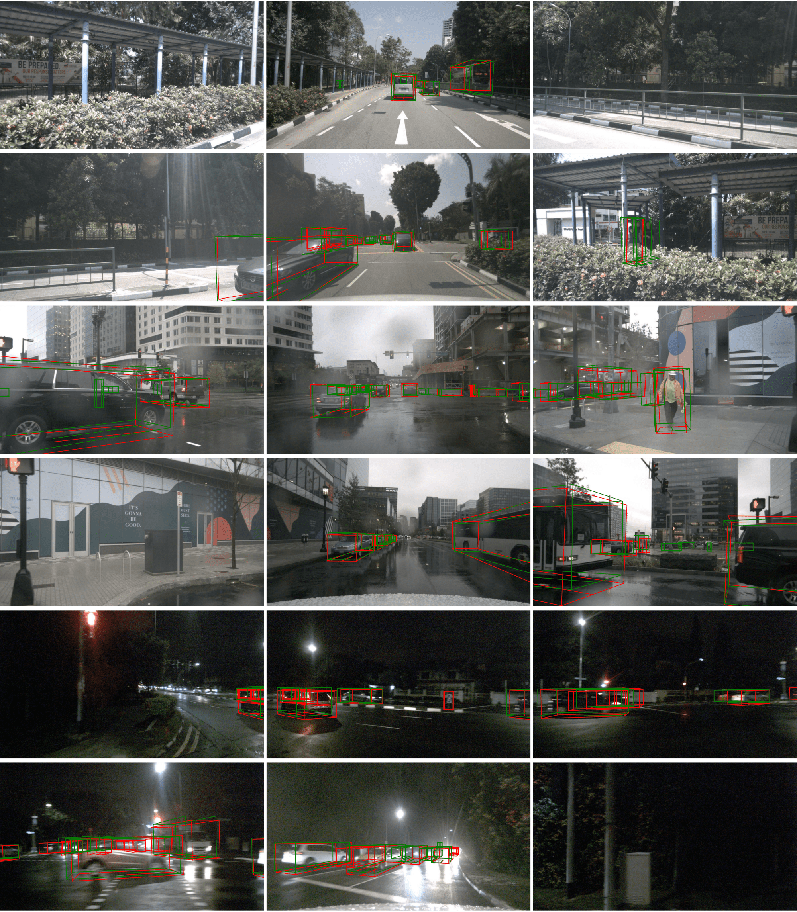
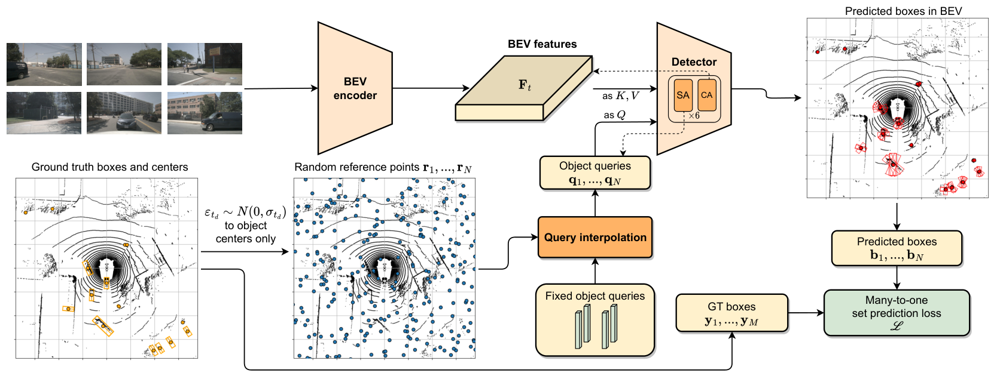

<div align="center">   
  
# Diffusion-Based Particle-DETR for BEV Perception
</div>




- [Paper in arXiv](https://arxiv.org/abs/2312.11578)


### Abstract
The Bird-Eye-View (BEV) is one of the most widely-used scene representations for visual perception in Autonomous Vehicles (AVs) due to its well suited compatibility to downstream tasks. For the enhanced safety of AVs, modeling perception uncertainty in BEV is crucial. Recent diffusion-based methods offer a promising approach to uncertainty modeling for visual perception but fail to effectively detect small objects in the large coverage of the BEV. Such degradation of performance can be attributed primarily to the specific network architectures and the matching strategy used when training. Here, we address this problem by combining the diffusion paradigm with current state-of-the-art 3D object detectors in BEV. We analyze the unique challenges of this approach, which do not exist with deterministic detectors, and present a simple technique based on object query interpolation that allows the model to learn positional dependencies even in the presence of the diffusion noise. Based on this, we present a diffusion-based DETR model for object detection that bears similarities to particle methods. Abundant experimentation on the NuScenes dataset shows equal or better performance for our generative approach, compared to deterministic state-of-the-art methods.


### Methods



### Getting Started
- [Installation](docs/install.md) 
- [Prepare Dataset](docs/prepare_dataset.md)
- [Run and Eval](docs/getting_started.md)


### Bibtex

```
@article{nachkov2023diffusion,
  title={Diffusion-Based Particle-DETR for BEV Perception},
  author={Nachkov, Asen and Danelljan, Martin and Paudel, Danda Pani and Van Gool, Luc},
  journal={arXiv preprint arXiv:2312.11578},
  year={2023}
}
```


### Acknowledgements

We sincerely thank the talented authors of [BEVFormer](https://github.com/fundamentalvision/BEVFormer), on whose implementation we base this project.
